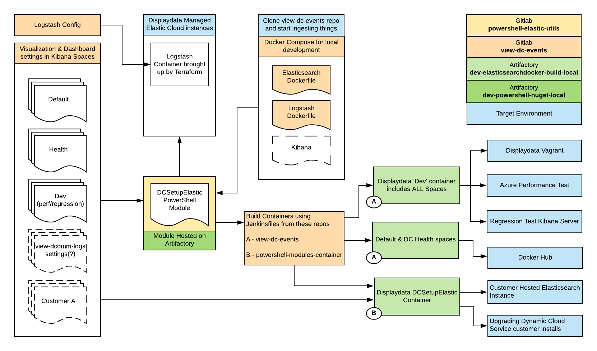

# view-dc-events

## 1.13.0 Release 

**Changes to managing Elasticsearch settings and how this repository is used**

The view-dc-events repo will no longer be merged to master and pushed to GitHub. 



Instead, containers will be provided externally to address these target environments (see diagram above): -
  * An internal 'dev' container including the regression test and other performance related visualizations

  * Elastic and Logstash containers on Displaydata docker hub with an associated README with a 'default' and 'health' space for distribution to customers for use in PILOTS only
    * This can also be used as the basis for customers looking at their own monitoring/reporting needs

  * Powershell container including the DCSetupElastic which is intended to be used in one of two ways 
    * end users upload settings to their own Elasticsearch instances
    * Displaydata Support to update Elastic Cloud
  
  * Settings (for visualizations and Dashboards in spaces) will ultimately reside separately in Artifactory as well
    * *This change is pending* 

  * Developers can clone the view-dc-events repo and quickly iterate on changes

## Changelog
Introduced a changelog to the view-dc-events repo *after* the release of 1.12.6 which was shipped on 31/06/2020

| Item                | Description                                                                |
|---------------------|----------------------------------------------------------------------------|
| Version Update      | Supports Elasticsearch 7.8.1                                               |
| Remove Dependency   | Removed Enhanced Table plugin from Kibana                                  |
| Use Vanilla Kibana  | Kibana Container is pulled direct from Docker Hub, rather than being built |

<!-- TODO: complete the changelog
-->

**WARNING**: This Elasticsearch setup does not guard against data loss and is only configured for a single node so it is **NOT** suitable for production environments.

## Pre-requisites

Ubuntu or Debian host machine (Minimum 4Gb RAM, >12Gb disk space) with the following installed:

* docker
* docker compose

Microsoft's WSL2 is also a suitable (local) environment for running these containers.

Also follow the 'post installation steps for Linux' section here:
https://docs.docker.com/install/linux/linux-postinstall/

This setup makes use of apt-get and bash scripts so cannot be run on Windows or non Ubuntu/Debian hosts.

If you're copying the files from a Windows machine rather than cloning direct from the repository on Github you need to make sure that the following files are executable in the linux environment:

* develop.sh

```shell
sudo chmod +x <filename>
```

### Cloud provider image options

Azure: https://azuremarketplace.microsoft.com/en-us/marketplace/apps/debian.debian-10?tab=Overview

AWS: https://aws.amazon.com/marketplace/pp/B073HW9SP3?qid=1571395555537&sr=0-1&ref_=srh_res_product_title

## Overview for local development

The repo consists of a docker-compose configuration file that uses off-the-shelf elasticsearch containers from https://www.docker.elastic.co which are then modified to contain all the Dynamic Solution specific index-templates, visualizations and dashboards. Displaydata's "Monitoring" document explains these dashboards, visualizations and their formats of specific events emitted from Dynamic Central. This document is available on request from Displaydata Support: <support@displaydata.com>

This repo pulls in a PowerShell Module called DCSetupElastic (which can also be distributed as a container) from Artifactory in order to avoid duplication of functions between this repository (view-dc-events) and the view-dcomm-logs repository, since the same PowerShell code is used to upload settings.

The docker host runs a separate container for each of; elasticsearch, kibana & logstash and mounts the configuration files and any data from the repo directory. In this new version the Kibana container is vanilla.

A separate docker volume is created for the elastic and logstash services. The elastic volume is mapped to the elasticsearch node data and contains the elastic indexes etc. The logstash volume is mapped to the logstash data directory and contains the information on what files have been processed and ingested into elastic.

Container volumes have been mounted externally so that the data (documents indexed into Elasticsearch) and settings will survive container upgrades or the container instances being removed. Running `./develop.sh clear` will purge EVERYTHING, including the Elasticsearch database so should only be run to achieve this specific outcome.

Once the environment is "up" the Kibana UI should be available via a browser on _host IP address_:5601

<!--
**NOTE:** The `./develop.sh ingest` script will start the containers and load
the saved objects. `./develop.sh update` is only required if you wish to update
the saved objects
-->

## Ingesting User events directly from Dynamic Central (pilots or Support)

This docker-compose setup can be used for ingesting and analysing Dynamic Solution's live user events. 

In order to set up `view-dc-events` to ingest Dynamic Central user events do the following on a Linux VM instance that already has docker and docker-compose installed:

```bash
$ # Clone the repo
$ git clone https://gitlab.dev.zbddisplays.local/internal/view-dc-events.git
$ # Start the containers
$ cd view-dc-events
$ docker-compose up -d
```

Now point your filebeat instances on your Dynamic Central Services at your VM instance e.g.

filebeat.yml:

```yaml
filebeat.config.inputs:
  enabled: true
  path: configs/*.yml
  reload.enabled: true
  reload.period: 10s

tags: ["dynamiccentral"]

output.logstash:
  # The Logstash hosts
  hosts: ["192.168.200.111:5044"]
```

configs/user.yml:

```yaml
- type: log
  paths:
    - C:\Dynamic Central\Working\Logs\User\*.json
    - C:\Dynamic Central\Working\Logs\User\*\*.json
  exclude_files: ['SystemStatus-.*']
  fields:
    type: user
  processors:
    -
      add_locale: ~
```

configs/status.yml:

```yaml
- type: log
  paths:
    - c:\Dynamic Central\Working\Logs\User\SystemStatus-*.json
    - c:\Dynamic Central\Working\Logs\User\*\SystemStatus-*.json
  fields:
    type: status
  processors:
    -
      add_locale: ~
```

config/audit.yml: 
```yaml
- type: log
  paths:
    - c:\Dynamic Central\Working\Logs\Audit\WebApi-*.json
    - c:\Dynamic Central\Working\Logs\Audit\*\WebApi-*.json
  fields:
    type: audit
  processors:
    -
      add_locale: ~
```

### Commands

`docker-compose down` - Stop the containers

`docker-compose up -d` - Start the containers

`docker-compose down -v` - Remove all running containers AND *delete volumes*

<!--> TODO: check this is still correct (below) -->

`./develop.sh export` - Export all current visualisations, dashboards etc. to `./dynamic/kibana/spaces` after moving the existing folder to `./dynamic/kibana/spaces~`

## Ingesting user events from locally saved log files

Install filebeat locally by following the installation guide(s) for your operating system. Filebeat is available for Windows via an .msi package.

Set up local config files as outlined above which reference different directories for each type of event:

```
\Logs\User\*.json
\Logs\Status\WebApi-*.json
\Logs\Audit\SystemStatus-*.json
```

Filebeat.yml will need to be able to send events to the *LOGSTASH* endpoint

On Windows filebeat appears to have somewhat strict installation permissions. It may be beneficial to add the local user to the permissions of folders which filebeat has installed in C:\ProgramData\Elastic\Beats\filebeat to avoid frustration.

## Vagrant file

If you're familiar with Hashicorp's Vagrant there is a Vagrantfile in this repo with providers for Virtualbox, VMWare Workstation or VMWare Fusion.

This will will bring up a Debian machine with the necessary pre-requisites and can be installed by running `vagrant up --provider <providername>`

# Logstash Pipeline Structure

Logstash makes use of multiple pipelines and pipeline-to-pipeline communication

Filebeat sends all Dynamic Central events to the input-beats pipeline, where they're split into individual indexes.

```
.\config\pipelines.yml (definitions)
  |
  |- input-beats
  |           |
  |           |- dynamic-user               => (User Events index)
  |           |- dynamic-display-state      => (Display State index)
  |           |- dynamic-communicator-state => (Communicator State index)
  |           |- dynamic-service-status     => (Dynamic Solution application Services index)
  |           |  
  |           |- dynamic-audit              => (Audit events for developer use only)   
  |           |- fallback                   => (any events that aren't indexed by the filters above)
  |
```

## Index definitions
Each index should be used for a specific purpose. Any application events that are of use for managing Dynamic Solution are described in the Monitoring document which is available from Displaydata Support on request.

### dynamic-user
This is the main index created in Elasticsearch which makes up the history of all interesting activity in the system. Events are indexed into the Elasticsearch document store by time. The vast majority of visualizations, dashboards, reports and alerts are driven from this incoming stream of events.

### dynamic-display-state
This index contains the most recent 'state' of each display and is an amalgamation of the following event types: -

* DisplayUpdateComplete
* SystemHealthcheck
* BatteryReplace
* DisplayConfigurationComplete
* DisplayRestorationPropertiesStageComplete
* DisplayUnconfigurationComplete

This allows better reporting on the 'state' of Displays individually, per location or across an entire estate. There is a single document per Display which will always contain the most recent result of attempting to change that display, depending on the command sent to it. 
 
If you have 3843 Displays then this index will contain 3843 documents, one per Display serial number.

This index now contains a wealth of information about a display which can be used for: -

  * Troubleshooting issues with an individual display
  * Understanding the overall 'health' of an installation
  * Reports and dashboards for groups of displays for use cases like
    * Asset tracking
    * Which displays responded to a healthcheck request recently
    * Which displays are up-to-date with the correct image

A document for a display in this index might look like this: - 

```
{
    "CommunicatorRssi": -55,
    "LocationName": "Soak Test 3B",
    "type": "user",
    "@version": "1",
    "GeoLocation": "51.408011,-0.724939",
    "Result": "NoError",
    "TemperatureOutOfRange": false,
    "PageNumber": 1,
    "RequestReference": "Page1.xml_1_2020-05-13T08:48:00.6312002Z",
    "date_object": "2020-05-13T08:48:29.058Z",
    "Duration": 14.307382899999999,
    "NodeName": null,
    "DisplaySerialNumber": "KB00301006B",
    "Timestamp": "2020-05-13T08:48:29.0582222Z",
    "path": "/logs/user/StatusMonitor-20200513.000.json",
    "@timestamp": "2020-05-19T13:05:44.080Z",
    "@t": "2020-05-13T09:48:29.0836882+01:00",
    "Action": "DownloadAndDisplay",
    "ObjectIds": [
      "00164535"
    ],
    "Success": true,
    "DisplayUpdateComplete": {
      "SuccessTimestamp": "2020-05-13T08:48:29.0582222Z"
    },
    "Temperature": 20.5,
    "DeliveryProcessRetries": 0,
    "MessageType": "DisplayUpdateComplete",
    "DisplayRssi": -65,
    "SystemHealthCheck: {
      "SuccessResult": "NoError",
      "SuccessTimestamp": "2020-05-13T00:05:56.0000000Z",
      "Success": "true"
    },
    "CommunicatorSerialNumber": "ZC00001547"    
  }
```

The following fields are updated by the most recent DisplayUpdateComplete event: - 

- Action
- CommunicatorRssi
- DeliveryProcessRetries
- Duration
- GeoLocation
- ObjectIds
- LocationName
- Temperature
- TemperatureOutOfRange
- DisplayUpdateComplete.Success (see below)

To help understand the state of a Display (following image updates particularly) additional fields are created...

- DisplayUpdateComplete.SuccessResult
- DisplayUpdateComplete.SuccessTimestamp

If a display is not updated successfully then the following fields are created: -

- DisplayUpdateComplete.FailureResult
- DisplayUpdateComplete.FailureTimestamp

This allows user to see when the last time a display updated successfully versus when it last failed to update its image as well as the reason why (Result). The `DisplayUpdateComplete.Success` field shows `true` if the display is showing the correct image and `false` if it is not. This field only shows the state of the **most recent** DisplayUpdateComplete message so it can be used specifically to address queries about image accuracy.

BatteryReplace and SystemHealthCheck events will also over-write the following if these events are more recent than the last BatteryReplace or SystemHealthCheck message type: -

- GeoLocation
- LocationName
- Temperature
- CommunicatorRssi

The following field values in SystemHealthCheck messages will also be added to the display's record. These values are included for completeness rather than utility. These fields should not be used for troubleshooting or analysis purposes.

 - CommunicatorSerialNumber
 - DisplayRssi

They will also **add** specific fields allowing users to understand the state of a Display in that moment: -

- BatteryReplace.Required = true - the Battery should be replaced in that display
- BatteryReplace.Timestamp - when was the Battery Replace message received
- Position - this is only present if customers have included the 'Assign to position' feature in their Hand Held Terminal implementation

- LastSystemHealthCheck.SuccessTimestamp - when was the last time the communicator was successfully able to talk to the Display
- LastSystemHealthCheck.SuccessResult - what was the result of the last successful healthcheck event?
- LastSystemHealthCheck.FailureTimestamp - when did the communicator most recently fail to talk to the display
- LastSystemHealthCheck.FailureResult - what was the result of the last successful healthcheck event?

DisplayConfigurationComplete, DisplayRestorationPropertiesStageComplete and DisplayUnconfigurationComplete message types will add the following events: -

- *messagetype*.Timestamp - when did configuration complete?
- *messagetype*.Result - what was the result
- *messagetype*.Success - success/fail

**NOTE**: MessageType and RequestReference fields will **ALWAYS** be over-written with the most recent event that has happened at that display.

Having a full picture with all event fields relies on those events having been passed through Logstash from the beginning of the installation being live. If this is not the case then this index will build up over time as each deployed display is sent a Display update or a SystemHealthCheck request by the communicator.

This information is extremely useful to supplement the Dynamic Central UI Displays page as it allows operations teams to ask the same sort of questions programmatically. 

An example could be to find how many displays have been updated in the last week with the correct image and have responded to a system healthcheck in the last week.

```
GET display-state-index/_count
{
  "query": {
    "bool": {
      "must": [
        {
        "match": {
          "Result": "NoError"
          }
        }
      ],
      "filter": {
        "range": {
          "SystemHealthcheck.SuccessTimestamp": {
            "gte": "now-7d",
            "lt": "now"
          }
        }
      }
    }
  }
}

```
This will return the total number of displays in an easy to parse format.

```
{
  "count" : 1128,
  "_shards" : {
    "total" : 2,
    "successful" : 2,
    "skipped" : 0,
    "failed" : 0
  }
}
```
Another example here would be to change the query value from 'success' to SystemHealthcheck.FailureTimestamp which would denote that the image on the display is correct from the most recent update but the SystemHealthCheck carried out in the last week failed.

The use of bucket aggregations would also allow a very quick count of the number of displays at a location and their respective state.

**NOTE**: Using script fields in the logstash output ensures that events of the same type aren't parsed out of order (preventing older events over-write newer events). This requires setting `script.max_compilations_rate: "10000/1m"` in Elasticsearch.yml so users should make sure this value is correct and works for their cluster.

### dynamic-communicator-state
This index contains the most recent 'state' of each communicator and works in the same way as the dynamic-display-state index but with CommunicatorStateChange message types.

### dynamic-service-status
This index contains the ongoing updates of changes to the Dynamic Solution Services. It's primarily used to trigger alerts if the state of a service changes to 'Stopped'. As this index contains documents for a Dynamic Solution Service indexed against time it can also be used to look at service stability over time.

### dynamic-audit
This index contains WebApi requests and responses and can be used by developers as a way of assisting development and debugging of their own API integration effort to drive Dynamic Solution. *NOTE*: These events are undocumented as they are meant as an assist to developers only. They are subjected to rapid change between releases and as such should not be used as the basis for 'managing' Dynamic Solution. They are provided purely as a useful feature for developers.

### fallback
Events that fall through any previous condition. This should not contain any entries
